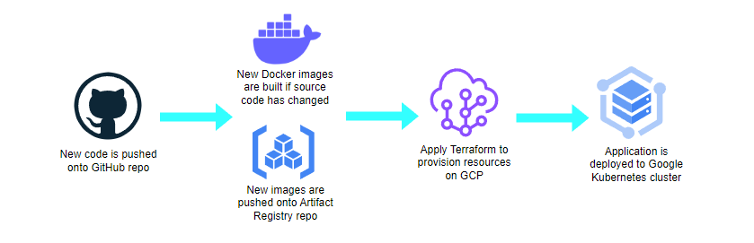

# CI/CD Pipeline with GitHub Actions

The CI/CD pipeline is built with **GitHub Actions** and triggers on every commit. For commits to the `master` branch, the pipeline deploys changes to the `prod` environment. Commits to any other branch trigger deployment to the `dev` environment.

### Pipeline Stages

1. **Build and Publish Docker Image**: When the source code of the `scraper` or `chatbot` is updated, the pipeline builds a new Docker image and publishes it to **Google Artifact Registry (GAR)**.
   
2. **Apply Terraform**: The pipeline applies Terraform to provision and manage the necessary infrastructure on **GCP**.

3. **Deploy to GKE**: The pipeline uses a **Helm** chart to deploy the application to a **GKE** cluster.

The pipeline is secured using **Workload Identity Federation** for authentication, and secrets are managed with **Google Secret Manager** and **GitHub Secrets**.

## Helm Chart
The Helm chart for deploying the chatbot application on GKE is located in the `chatbot/helm` directory and includes the following files in the template:

- **`deployment.yaml`**: Defines the deployment configuration for the chatbot, which includes basic configurations with specific strategy, tolerations, and affinity rules for efficient and high-availability deployment.
- **`service.yaml`**: Configures the service to expose the application using NodePort.
- **`serviceaccount.yaml`**: Sets up a service account to authenticate the chatbot with GCP services using Workload Identity Federation.

Environment-specific variables for development and production are stored in the `values` directory.
