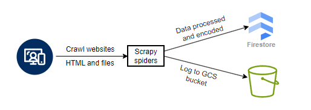

# Scrapy spiders for web crawling

This repository contains a Scrapy project that scrapes data from the [Oberlin College website](https://www.oberlin.edu) and [catalog](https://www.catalog.oberlin.edu). The scraper processes all HTML and files, encodes the data, and stores it in **Firestore** for efficient vector-based retrieval by the chatbot. All spiders are deployed on **Cloud Run** and scheduled to run daily with **Cloud Scheduler** to keep the chatbot updated with the latest information.

The workflow is as follows:
- The spiders crawl the Oberlin College website and catalog to retrieve HTML content and files.
- The retrieved content is processed, transformed in to text, cleaned, chunked into smaller pieces for efficient retrieval.
- If the data doesn't exist in Firestore or has been updated, it is encoded then added in Firestore.
- After the spider has finished crawling, the log and output are stored in Cloud Storage for monitoring and debugging purposes.

For deployment to CLoud Run, please refer to 