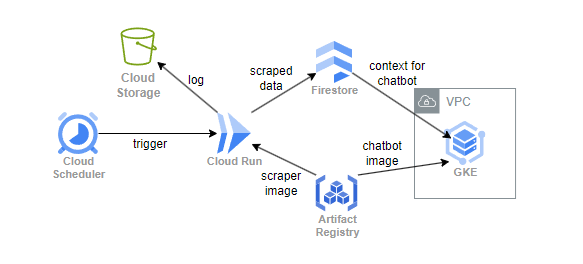

# Terraform

This directory contains the Terraform configuration for provisioning and managing the necessary infrastructure on **Google Cloud Platform (GCP)**.

The resources include:
- **Firestore**
  - Database
  - Vector Index for vector retrieval
- **Google Artifact Registry**
  - Docker Repository for `dev` and `prod` images
- **Cloud Run** to deploy the scraper job
- **Cloud Scheduler** to trigger the scraper job
- **Cloud Storage** buckets for storing the scraper job logs
- **Google Kubernetes Engine (GKE)** cluster for deploying the chatbot application
  - Separate node pool for each environment with taints to optimize pod placement
  - A node pool with public IPs serving as the entry point to the chatbot
- **VPC Network** with **firewall** rules for GKE cluster
  - Allows inbound traffic to the chatbot application on specific ports
